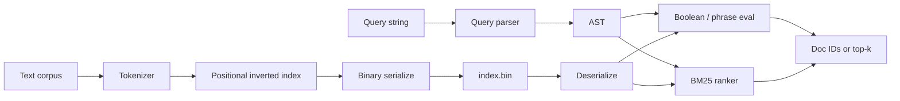

# Mini Search Engine (C++)

From-scratch C++20 information retrieval: positional inverted index, boolean + phrase
queries, BM25 top-k, compressed index I/O, and a few posting-list intersection variants
with measured latency.

Numbers below are from a Linux x86_64 / Ubuntu 24.04 / Clang 18 Release build on a
synthetic 5k-doc corpus (see [`docs/bench-latest.md`](docs/bench-latest.md)):

- ~140k docs/s index build
- BM25 p50 ≈ 894 µs, p95 ≈ 1.03 ms
- Galloping intersection ~96% faster p95 than two-pointer on a skewed list pair
- Index ~0.84 MB on disk; RSS ≈ 11.8 MiB after build

CI runs 55 Catch2 tests on Linux / macOS / Windows (Debug + Release), plus ASan/UBSan,
clang-format, clang-tidy, and a short libFuzzer job.

## Features

- Boolean queries: `AND` / `OR` / `NOT`, parentheses, juxtaposition = AND
- Phrase search via positional postings (`"adjacent tokens"`)
- BM25 ranked retrieval with a top-k heap
- Tokenizer: case folding, punctuation splitting, optional stopwords + Porter stemming
- Query parser with offset + message on syntax errors
- Two-pointer, galloping, and skip-pointer posting intersection
- Binary index save/load (`MSEI` v2, delta + varbyte); optional mmap load
- Optional multithreaded tokenization (`--threads N`) and synonym rewrite (`--synonyms`)

## Architecture



Core structure: term → sorted postings `(doc_id, [positions...])`, plus per-doc length
and global `N` / `avgdl` for BM25.

## Complexity

| Operation | Time (typical) | Notes |
|-----------|----------------|-------|
| Index build | O(T) | T = total tokens |
| AND (two-pointer) | O(\|A\| + \|B\|) | Baseline |
| AND (galloping) | O(\|short\| · log\|long\|) | Helps when lengths are skewed |
| Phrase | O(candidates · phrase_len) | Position adjacency check |
| BM25 top‑k | O(\|D_q\| · \|q\| + \|D_q\| log k) | Min-heap of size k |
| Serialize / load | O(postings) | v2: delta + varbyte |
| Parallel tokenize | O(T / threads) | Index assembly stays serial |

## Quick start

```bash
cmake -S . -B build -DCMAKE_BUILD_TYPE=Release
cmake --build build -j
ctest --test-dir build --output-on-failure

# Build an index from fixtures
./build/search index build data/fixtures -o index.bin --threads 4

# Boolean / phrase
./build/search query index.bin 'cats AND (milk OR dogs)' --mode boolean --intersect skip
./build/search query index.bin kitten --mode boolean --synonyms data/synonyms.txt --mmap

# Ranked
./build/search query index.bin 'cats milk' --mode bm25 --topk 5

# Benchmarks
./build/mse_bench --docs 5000 --out docs/bench-latest.md
# or: ./scripts/run_benchmarks.sh 5000
```

CMake options: `MSE_BUILD_TESTS`, `MSE_BUILD_BENCH`, `MSE_BUILD_FUZZ`, `MSE_ENABLE_ASAN`,
`MSE_ENABLE_UBSAN`, `MSE_ENABLE_CLANG_TIDY`.

## Benchmark results

From [`docs/bench-latest.md`](docs/bench-latest.md) (same machine / flags as above, seed=42):

| Metric | Value |
|--------|-------|
| Docs | 5,000 |
| Build throughput | ~139,964 docs/s |
| Index on disk | ~0.84 MB |
| RSS after build | ~11.8 MiB |
| BM25 p50 / p95 | 894 µs / 1.03 ms |
| Intersect two-pointer p95 | 50.3 µs |
| Intersect galloping p95 | 1.8 µs |
| Galloping p95 improvement | ~96.4% |

How these are measured: [`docs/performance.md`](docs/performance.md).

## Docs

- [`docs/query-language.md`](docs/query-language.md) — syntax and errors
- [`docs/design.md`](docs/design.md) — indexing, ranking, intersection
- [`docs/performance.md`](docs/performance.md) — bench methodology
- [`docs/ROADMAP.md`](docs/ROADMAP.md) — what’s done / what’s next
- [`CONTRIBUTING.md`](CONTRIBUTING.md) — build, format, tests
- [`CHANGELOG.md`](CHANGELOG.md)
- [Releases](https://github.com/Alena-Voronchikhina/mini-search-engine-cpp/releases) ·
  [Issues](https://github.com/Alena-Voronchikhina/mini-search-engine-cpp/issues) ·
  [Actions](https://github.com/Alena-Voronchikhina/mini-search-engine-cpp/actions)

## Layout

```
include/mse/     Public headers
src/             Library + CLI (search)
tests/           Catch2 (55 cases)
benchmarks/      mse_bench
data/fixtures/   Tiny demo corpus
scripts/         Corpus prep + bench runners
docs/            Design notes + published numbers
```

## Limitations

- Skip tables are rebuilt in memory; not stored in the on-disk index yet
- Synonym expansion does not re-weight BM25 terms
- Bench corpus is synthetic (a public collection like an MS MARCO subset would be nicer)

## License

Personal project — see the repository for terms.
