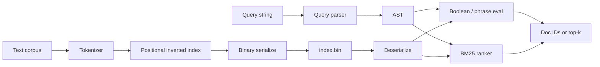

# Mini Search Engine (C++)

A from-scratch **information retrieval** engine in modern C++20: positional inverted index, boolean + phrase queries, BM25 top‑k ranking, index serialization, and measurable posting-list optimizations.

**Outcomes (Linux x86_64, Ubuntu 24.04, Clang 18, Release, synthetic 5k-doc corpus):**
- Indexes **~140k docs/s**
- BM25 query **p50 ≈ 894 µs**, **p95 ≈ 1.03 ms**
- Galloping intersection cuts skewed-list **p95 latency by ~96.4%** vs two-pointer
- Index **~0.84 MB** on disk; process **RSS ≈ 11.8 MiB** after build
- **55 tests** pass in CI across Linux / macOS / Windows (Debug+Release), plus **ASan+UBSan**, **clang-format**, **clang-tidy (Werror)**, fuzz smoke, and a **60s libFuzzer** campaign

## Features

- Boolean queries: `AND` / `OR` / `NOT`, parentheses, juxtaposition = AND
- Phrase search: `"adjacent tokens"` via positional postings
- BM25 ranked retrieval with top‑k heap
- Tokenizer: case folding, punctuation splitting, optional stopwords + Porter stemming
- Query parser with offset + message on syntax errors
- Two-pointer, **galloping**, and **skip-pointer** posting intersection
- Binary index save/load (`MSEI` v2 with delta+varbyte compressed postings); optional **mmap** load
- Optional multithreaded tokenization (`--threads N`) and **synonym rewrite** (`--synonyms`)
- Catch2 tests, fuzz smoke + libFuzzer CI, clang-format + clang-tidy Werror; benchmark harness with published numbers

## Architecture



**Core data structure:** term → sorted postings `(doc_id, [positions...])`, plus per-doc length and global `N` / `avgdl` for BM25.

## Complexity

| Operation | Time (typical) | Notes |
|-----------|----------------|-------|
| Index build | O(T) | T = total tokens |
| AND (two-pointer) | O(\|A\| + \|B\|) | Baseline |
| AND (galloping) | O(\|short\| · log\|long\|) | Wins when lengths are skewed |
| Phrase | O(candidates · phrase_len) | Position adjacency check |
| BM25 top‑k | O(\|D_q\| · \|q\| + \|D_q\| log k) | Min-heap of size k |
| Serialize / load | O(postings) | v2: delta + varbyte compressed |
| Parallel tokenize | O(T / threads) | Index assembly remains serial |

## Quick start

```bash
cmake -S . -B build -DCMAKE_BUILD_TYPE=Release
cmake --build build -j
ctest --test-dir build --output-on-failure

# Build an index from fixtures (parallel tokenize)
./build/search index build data/fixtures -o index.bin --threads 4

# Boolean / phrase
./build/search query index.bin 'cats AND (milk OR dogs)' --mode boolean --intersect skip
./build/search query index.bin kitten --mode boolean --synonyms data/synonyms.txt --mmap

# Ranked
./build/search query index.bin 'cats milk' --mode bm25 --topk 5

# Benchmarks
./build/mse_bench --docs 5000 --out docs/bench-latest.md
# or: ./scripts/run_benchmarks.sh 5000
```

CMake options: `MSE_BUILD_TESTS`, `MSE_BUILD_BENCH`, `MSE_BUILD_FUZZ`, `MSE_ENABLE_ASAN`, `MSE_ENABLE_UBSAN`, `MSE_ENABLE_CLANG_TIDY`.

## Benchmark results

From [`docs/bench-latest.md`](docs/bench-latest.md) (Linux x86_64, Ubuntu 24.04, Clang 18, Release, seed=42):

| Metric | Value |
|--------|-------|
| Docs | 5,000 |
| Build throughput | ~139,964 docs/s |
| Index on disk | ~0.84 MB |
| RSS after build | ~11.8 MiB |
| BM25 p50 / p95 | 894 µs / 1.03 ms |
| Intersect two-pointer p95 | 50.3 µs |
| Intersect galloping p95 | 1.8 µs |
| **Galloping p95 improvement** | **~96.4%** |

Methodology: [`docs/performance.md`](docs/performance.md).

## Documentation

- [`docs/query-language.md`](docs/query-language.md) — syntax, precedence, errors
- [`docs/design.md`](docs/design.md) — indexing, ranking, intersection
- [`docs/performance.md`](docs/performance.md) — how numbers are measured
- [`docs/ROADMAP.md`](docs/ROADMAP.md) — completed checklist + stretch goals
- [`CONTRIBUTING.md`](CONTRIBUTING.md) — coding standards + how to contribute
- [`CHANGELOG.md`](CHANGELOG.md)

## Project status (portfolio)

| Signal | Where |
|--------|-------|
| Releases + tags | [GitHub Releases](https://github.com/Alena-Voronchikhina/mini-search-engine-cpp/releases) (`v0.2.0`–`v0.4.0`) |
| Changelog | [`CHANGELOG.md`](CHANGELOG.md) |
| Planned / completed work | [`docs/ROADMAP.md`](docs/ROADMAP.md) + [Issues](https://github.com/Alena-Voronchikhina/mini-search-engine-cpp/issues) |
| CI green across OSes | [Actions](https://github.com/Alena-Voronchikhina/mini-search-engine-cpp/actions) |

## Project layout

```
include/mse/     Public library headers
src/             Library + CLI (search)
tests/           Catch2 (55 cases)
benchmarks/      mse_bench harness
data/fixtures/   Tiny corpus for demos/tests
scripts/         Corpus prep + benchmark runners
docs/            Design + methodology + latest numbers
```

## Contributing

See [`CONTRIBUTING.md`](CONTRIBUTING.md). Short version: C++20, clang-format, keep tests green, prefer small PRs.

## Limitations & future work

- Skip tables are rebuilt in memory; not yet persisted as a separate on-disk structure
- Synonym expansion does not re-weight BM25 term importance
- Bench corpus is synthetic; public IR collections (e.g. MS MARCO subset) are optional follow-ups
- See [`docs/ROADMAP.md`](docs/ROADMAP.md) for stretch ideas

## License

Personal portfolio project — see repository for terms.
