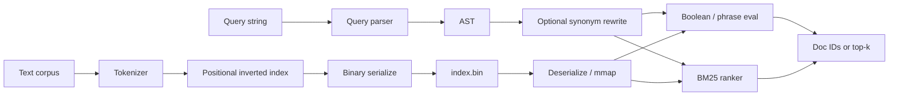
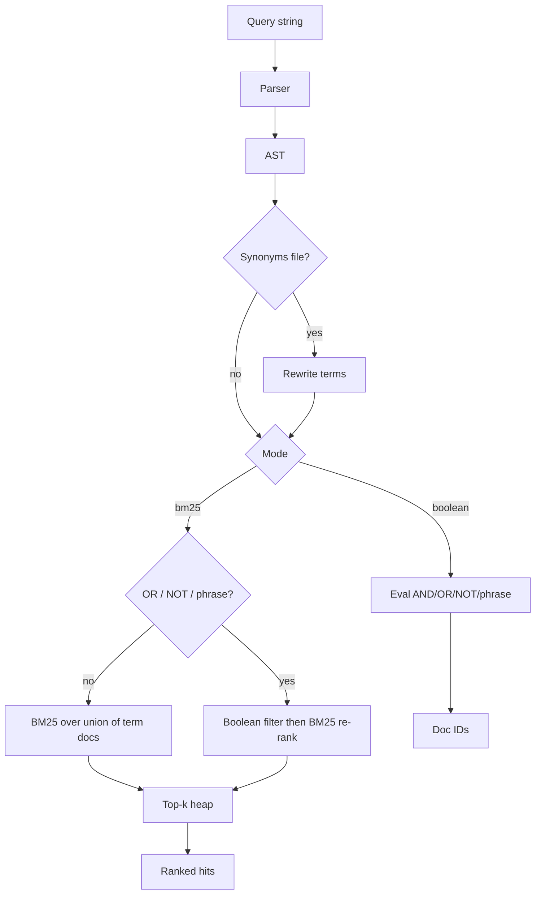

# Mini Search Engine (C++)

[](https://github.com/Alena-Voronchikhina/mini-search-engine-cpp/actions/workflows/ci.yml)
[](docs/coverage-latest.md)

From-scratch C++20 information retrieval: positional inverted index, boolean + phrase
queries, BM25 top-k, compressed index I/O, and a few posting-list intersection variants
with measured latency.

Numbers below are from a Linux x86_64 / Ubuntu 24.04 / Clang 18 Release build on a
synthetic 5k-doc corpus (see [`docs/bench-latest.md`](docs/bench-latest.md)):

- ~37k docs/s index build
- BM25 p50 ≈ 3.64 ms, p95 ≈ 4.07 ms
- Galloping intersection ~98.6% faster p95 than two-pointer on a skewed list pair
- Index ~0.84 MB on disk; RSS ≈ 12.0 MiB after build

CI runs 55 Catch2 tests on Linux / macOS / Windows (Debug + Release), plus ASan/UBSan,
clang-format, clang-tidy, libFuzzer, and a coverage job.

## Features

- Boolean queries: `AND` / `OR` / `NOT`, parentheses, juxtaposition = AND
- Phrase search via positional postings (`"adjacent tokens"`)
- BM25 ranked retrieval with a top-k heap
- Tokenizer: case folding, punctuation splitting, optional stopwords + Porter stemming
- Query parser with offset + message on syntax errors
- Two-pointer, galloping, and skip-pointer posting intersection
- Binary index save/load (`MSEI` v2, delta + varbyte); optional mmap load
- Optional multithreaded tokenization (`--threads N`) and synonym rewrite (`--synonyms`)

## Architecture



Indexing path: tokenize each document → append positions into per-term posting lists →
`finalize()` (sort by `doc_id`, compute `avgdl`) → write `MSEI` v2. Optional
`--threads N` parallelizes tokenization; index assembly stays on the main thread.

More detail: [`docs/design.md`](docs/design.md).

## Data Structures

Core in-memory layout (`include/mse/types.hpp`, `include/mse/index.hpp`):

- `term → vector<Posting>` where `Posting = { doc_id, positions[] }`
- `documents[]`: path + token length per doc
- Globals for ranking: `N` (num docs) and `avgdl`
- Boolean AND can build in-memory skip tables (`SkipList`: docs + every ~√n forward jump)
- On disk: `MSEI` little-endian; **v2** (default) delta-encodes doc ids / positions then
  varbyte-compresses; loaders still accept uncompressed **v1**

Skip tables are rebuilt when needed and are not stored in `index.bin` yet.

## Query Flow



1. Parse into an AST (errors include offset + message).
2. Optional synonym rewrite expands terms before eval.
3. **Boolean / phrase:** recursive eval; AND uses the selected intersect mode
   (`galloping` default; also `two_pointer`, `skip`).
4. **BM25:** bag-of-AND queries score the union of term docs; queries with `OR` /
   `NOT` / phrases filter first, then re-rank. Top-k uses a size-`k` min-heap.

Syntax: [`docs/query-language.md`](docs/query-language.md).

## Complexity

| Operation | Time (typical) | Notes |
|-----------|----------------|-------|
| Index build | O(T) | T = total tokens |
| AND (two-pointer) | O(\|A\| + \|B\|) | Baseline |
| AND (galloping) | O(\|short\| · log\|long\|) | Helps when lengths are skewed |
| Phrase | O(candidates · phrase_len) | Position adjacency check |
| BM25 top‑k | O(\|D_q\| · \|q\| + \|D_q\| log k) | Min-heap of size k |
| Serialize / load | O(postings) | v2: delta + varbyte |
| Parallel tokenize | O(T / threads) | Index assembly stays serial |

## Tradeoffs

**Intersection strategy.** Two-pointer is the simple merge and usually wins when list
lengths are similar. Galloping (default) iterates the short list and exponential-searches
the long one — on the harness’s skewed pair (long ≈ `max(10N, 50k)`, short = every 997th
id) it cut p95 by ~98% vs two-pointer. Skip pointers trade a bit of memory / setup for
another jump-friendly mode (`--intersect skip`). Pick with `--intersect`; measure on your
lists rather than assuming one winner.

**Memory vs speed / I/O.** The working index keeps full positional postings in RAM so
phrases and BM25 stay simple. On disk, v2 compression shrinks `index.bin` (bench: ~0.84 MB
for 5k synthetic docs while RSS after build is ~12 MiB). `--mmap` avoids a full copy into
heap-owned buffers at load time. Skip tables are still memory-only — persisting them would
speed cold AND queries but grow the file format.

## Quick start

```bash
cmake -S . -B build -DCMAKE_BUILD_TYPE=Release
cmake --build build -j
ctest --test-dir build --output-on-failure

# Build an index from fixtures
./build/search index build data/fixtures -o index.bin --threads 4

# Boolean / phrase
./build/search query index.bin 'cats AND (milk OR dogs)' --mode boolean --intersect skip
./build/search query index.bin kitten --mode boolean --synonyms data/synonyms.txt --mmap

# Ranked
./build/search query index.bin 'cats milk' --mode bm25 --topk 5

# Benchmarks
./scripts/bench.sh 5000 docs/bench-latest.md
```

CMake options: `MSE_BUILD_TESTS`, `MSE_BUILD_BENCH`, `MSE_BUILD_FUZZ`, `MSE_ENABLE_ASAN`,
`MSE_ENABLE_UBSAN`, `MSE_ENABLE_CLANG_TIDY`, `MSE_ENABLE_COVERAGE`.

## Benchmark results

### Machine

See the auto-captured block in [`docs/bench-latest.md`](docs/bench-latest.md) (OS, CPU,
RAM, compiler). Published numbers assume `CMAKE_BUILD_TYPE=Release`.

### Dataset

Synthetic corpus inside `mse_bench`: ~26-term fixed vocabulary, document length 20–80
tokens, seed `42`. Good for comparing intersect modes and BM25 latency on this machine;
not a substitute for a public collection. On-disk variant:

```bash
./scripts/prepare_corpus.sh data/bench 5000 42
./build/search index build data/bench -o /tmp/bench.bin
```

### Command

```bash
cmake -S . -B build -DCMAKE_BUILD_TYPE=Release -DMSE_BUILD_BENCH=ON
cmake --build build -j
./scripts/bench.sh 5000 docs/bench-latest.md
```

Methodology: [`docs/performance.md`](docs/performance.md).

### Results

From [`docs/bench-latest.md`](docs/bench-latest.md) (seed=42):

| Metric | Value |
|--------|-------|
| Docs | 5,000 |
| Build throughput | ~36,576 docs/s |
| Index on disk | ~0.84 MB |
| RSS after build | ~12.0 MiB |
| BM25 p50 / p95 | 3.64 ms / 4.07 ms |
| Intersect two-pointer p95 | 533 µs |
| Intersect galloping p95 | 7.7 µs |
| Galloping p95 improvement | ~98.6% |

## CI

GitHub Actions workflow [`ci.yml`](.github/workflows/ci.yml):

- **build-test** — ubuntu / macOS / windows × Debug / Release (`ctest` + fuzz smoke)
- **sanitizers** — ASan + UBSan
- **libfuzzer** — 60s Clang libFuzzer run
- **clang-tidy** / **clang-format**
- **coverage** — `scripts/coverage.sh` → [`docs/coverage-latest.md`](docs/coverage-latest.md)

## What I’d build next

- Distributed shards (term- or doc-partitioned) with scatter/gather query
- Incremental / near-real-time indexing (segments + deletes)
- Persist skip tables inside `MSEI`
- Feed synonym expansions into BM25 term weights
- Bench on a public collection (e.g. an MS MARCO subset)

Tracked in [`docs/ROADMAP.md`](docs/ROADMAP.md).

## Docs

- [`docs/query-language.md`](docs/query-language.md) — syntax and errors
- [`docs/design.md`](docs/design.md) — indexing, ranking, intersection
- [`docs/performance.md`](docs/performance.md) — bench methodology
- [`docs/ROADMAP.md`](docs/ROADMAP.md) — what’s done / what’s next
- [`CONTRIBUTING.md`](CONTRIBUTING.md) — build, format, tests, coverage
- [`CHANGELOG.md`](CHANGELOG.md)
- [Releases](https://github.com/Alena-Voronchikhina/mini-search-engine-cpp/releases) ·
  [Issues](https://github.com/Alena-Voronchikhina/mini-search-engine-cpp/issues) ·
  [Actions](https://github.com/Alena-Voronchikhina/mini-search-engine-cpp/actions)

## Layout

```
include/mse/     Public headers
src/             Library + CLI (search)
tests/           Catch2 (55 cases)
benchmarks/      mse_bench
data/fixtures/   Tiny demo corpus
scripts/         Corpus prep + bench + coverage
docs/            Design notes + published numbers
```

## Limitations

- Skip tables are rebuilt in memory; not stored in the on-disk index yet
- Synonym expansion does not re-weight BM25 terms
- Bench corpus is synthetic (a public collection like an MS MARCO subset would be nicer)

## License

Personal project — see the repository for terms.
